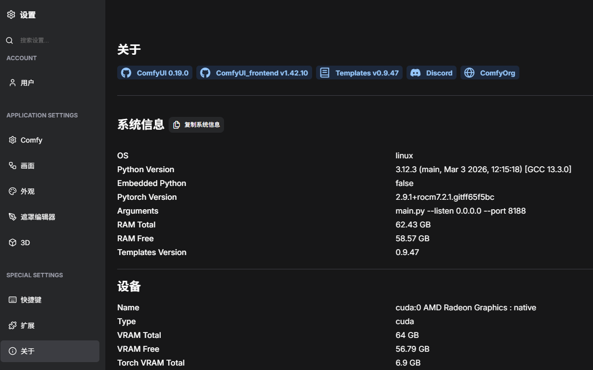

# ComfyUI ROCm Docker Image

🔥 **ComfyUI with AMD ROCm support** - Run ComfyUI on AMD GPUs with optimized ROCm-compatible dependencies.

[](https://hub.docker.com/r/corundex/comfyui-rocm) [](https://rocm.docs.amd.com/) [](https://www.amd.com/en/products/graphics/desktops/radeon.html)

🔥🔥🔥 **Warning: please pay 100% attention** - Do not update to Rocm 7.2 it not work for AI MAX series CPU on ComfyUI yet.🔥🔥🔥

🔥🔥🔥 Any questions can be raised here https://github.com/gexqin/ComfyUI-ROCm/issues  replies irregularly depending on mood🔥🔥🔥


*ComfyUI running on AMD ROCm with sample workflow and generated landscape image*

## 📋 Version Information

- **Base Image**: `rocm/pytorch:rocm7.1.1_ubuntu24.04_py3.12_pytorch_release_2.9.1`
- **Python**: 3.12.3
- **PyTorch**: 2.9.1
- **ROCm**: 7.1.1
- **ComfyUI**: v0.14.2 

## ✨ Key Features

- 🎨 **Node-based AI workflow** - Visual interface for creating complex AI pipelines
- 🔥 **AMD ROCm optimized** - Native AMD GPU acceleration with ROCm 7.1+
- 📦 **Smart model management** - Automatic downloads with configurable model sets
- 🧪 **Tested compatibility** - All dependencies verified on real AMD hardware
- 🎯 **Ready to use** - Pre-configured with sample workflows
- 💾 **Persistent storage** - Models and outputs preserved across restarts


## 🚀 Quick Start

# docker-compose.yaml
```yaml
services:
  comfyui-rocm:
    image: qinzhen/comfyui-rocm:latest 
    container_name: comfyui-rocm
    runtime: runc
    devices:
      - /dev/kfd:/dev/kfd
      - /dev/dri:/dev/dri
    group_add:
      - video
    ports:
      - "8188:8188"
    volumes:
      - ./data/models:/workspace/ComfyUI/models
      - ./data/output:/workspace/ComfyUI/output
      - ./data/input:/workspace/ComfyUI/input
      - ./data/custom_nodes:/workspace/ComfyUI/custom_nodes
      - ./data/user:/workspace/ComfyUI/user
    environment:
      - MODEL_DOWNLOAD=default
      - TORCH_ROCM_AOTRITON_ENABLE_EXPERIMENTAL=1
      - TORCH_CUDNN_ENABLED=0
      - HIP_LAUNCH_BLOCKING=1
      - TORCH_SHOW_CPP_STACKTRACES=1
      - HSA_OVERRIDE_GFX_VERSION=11.5.1
    restart: unless-stopped
```
Run with: `docker compose up -d`
ComfyUI 0.14.2 listen on: **http://0.0.0.0:8188**

## 📋 Requirements

| Component  | Requirement                                |
| ---------- | ------------------------------------------ |
| **GPU**    | AMD series with ROCm RDNA 2-4 support      |
|   Depends on number of - HSA_OVERRIDE_GFX_VERSION=      |
| **VRAM**   | 8GB minimum (16GB+ recommended)            |
| **OS**     | Linux (Ubuntu 24.04+ recommended)          |
| **Docker** | Latest official version (29.1.4)           |
| **Pytorch**| Version 2.9.1+rocm7.1.1.git351ff442        |
| **ROCm**   | Drivers 7.1.1+ installed on host           |

## 🔧 Setup Instructions

### 1. Install ROCm Drivers(Please install Rocm 7.1.1) 

https://rocm.docs.amd.com/projects/install-on-linux/en/latest/install/quick-start.html

wget https://repo.radeon.com/amdgpu-install/7.1.1/ubuntu/noble/amdgpu-install_7.1.1.70101-1_all.deb (Rocm 7.1.1 there)

### 2. Verify ROCm Installation
```bash
rocminfo  # Should show your AMD GPU model in Agent 2
```
For example

*******                  
Agent 2                  
*******                  
  Name:                    gfx1151                            
  Uuid:                    GPU-XX                             
  Marketing Name:          AMD Radeon Graphics                
  Vendor Name:             AMD                                
  Feature:                 KERNEL_DISPATCH                    
  Profile:                 BASE_PROFILE                       
  Float Round Mode:        NEAR                               
  Max Queue Number:        128(0x80)                          
  Queue Min Size:          64(0x40)                           
  Queue Max Size:          131072(0x20000)                    
  Queue Type:              MULTI                              
  Node:                    1                                  
  Device Type:             GPU                                
  Cache Info:              
    L1:                      32(0x20) KB                        
    L2:                      2048(0x800) KB                     
    L3:                      32768(0x8000) KB                   
  Chip ID:                 5510(0x1586) 


## ⚡ Performance & Hardware

### Tested Hardware
- **AMD AI MAX+ 395 (128GB VRAM) 96/32 ✅
- **AMD AI MAX+ 395 (128GB VRAM) 64/64 ✅

### Tested Templates
| Templates        | Main Models                   | Status                                                |
| ---------------- | ----------------------------- | ----------------------------------------------------- |
| `NewBie Exp0.1`  | NewBie-Image-Exp0.1-bf16      | Work sometimes requires retries                       |
| `SDXL Turbo`     | sd_xl_turbo_1.0_fp16          | Work good                                             |
| `Z-Image-Turbo Text to Image`       | z_image_turbo_bf16                         | Work good             |
| `Z-Image-Turbo Fun Controlnet Union`| z_image_turbo_bf16                         | Work good             |
| `NetaYume Lumina Text to Image`     | NetaYumev35_pretrained_all_in_one          | Work good             |
| `Qwen Image 2512`                   | qwen_image_2512_fp8        |   Works requires more than 40 GB of system memory |
| `Qwen Image Edit 2511`              | qwen_image_edit_2511_bf16  |   Works requires more than 40 GB of system memory |

## 📄 License & Credits

This project is licensed under GPL-3.0. See the [LICENSE](LICENSE) file for details.

### Third-Party Components
- **ComfyUI**: GPL-3.0 - [ComfyUI](https://github.com/comfyanonymous/ComfyUI)
- **PyTorch**: BSD 3-Clause - [PyTorch](https://pytorch.org/)
- **ROCm**: Various OSS licenses - [AMD ROCm](https://rocm.docs.amd.com/)

**Acknowledgments:**
- [ComfyUI](https://github.com/Comfy-Org/ComfyUI) - Node-based AI workflow interface
- [AMD ROCm](https://rocm.docs.amd.com/) - Open source GPU computing platform  
- ROCm community for AMD GPU AI support

---

🔗 **Links:** [Docker Hub](https://hub.docker.com/r/qinzhen/comfyui-rocm) | [GitHub](https://github.com/gexqin/ComfyUI-ROCm) | [ComfyUI](https://github.com/Comfy-Org/ComfyUI)
