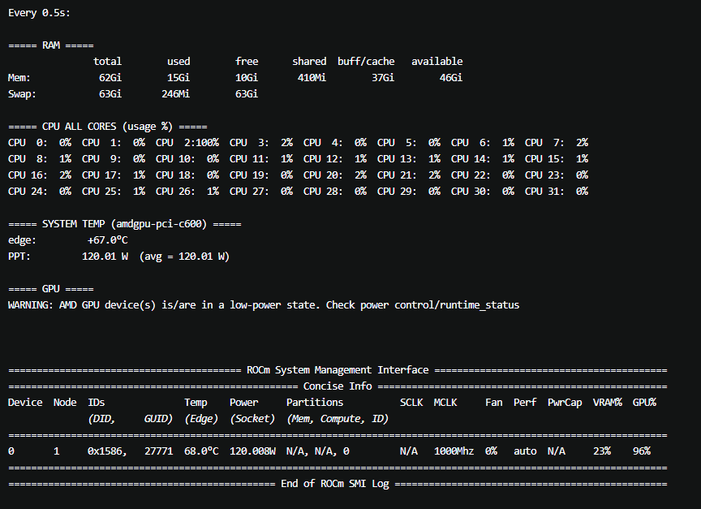

# Monitor-script for AMD AI MAX+ 395



#*Monitor-script for AMD AI MAX+ 395 tested on Ubuntu24.04 LTS*

## 📋 For System Temperature Function need install lm-sensors

```bash
sudo apt install lm-sensors -y
sudo sensors-detect #Initialization (only once) All answers yes automatic scan sensor
```
